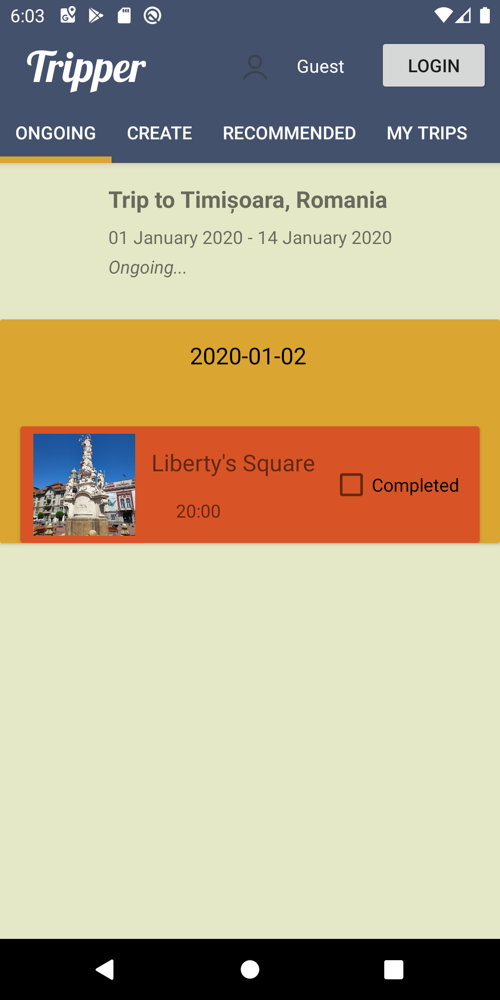
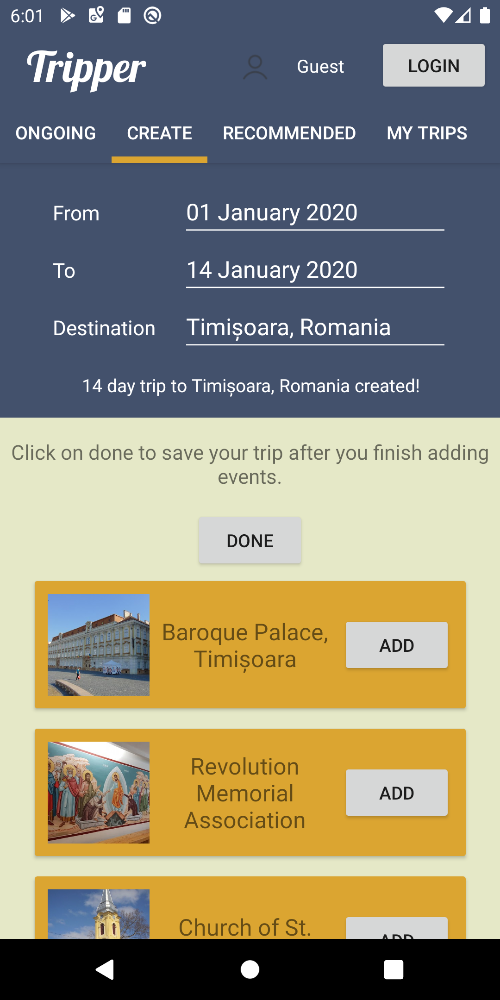
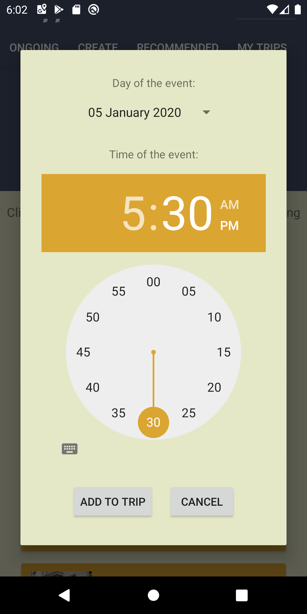
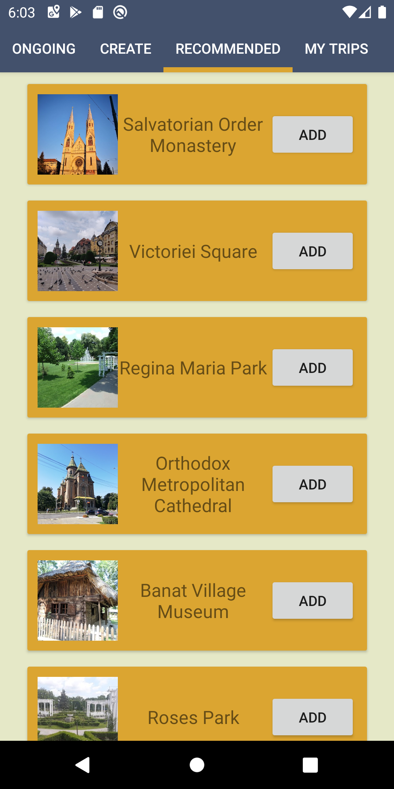
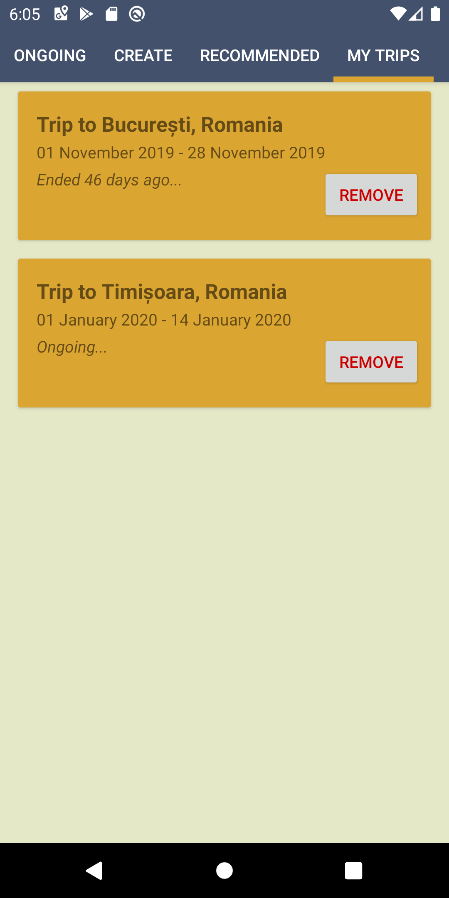

Tripper is the android application you didn't even know you needed. Do you ever go on city breaks? Say no more: Tripper will set you up.

All credit goes to:
- [Diana Sebo]
- [Ameteo Stan]

## Documentation

### 1. Introduction
  - **What ?**
    
    The application is meant to be a lightweight companion on citybreaks. It will help you find interesting spots to check out wherever you are (as long as google knows about it), organize the places that spark your interest in an hourly schedule and mark places you've already seen.

  - **Why ?**

    The ideea came up after a citybreak. Looking back, we never got to visit all the places we would have wanted because we could not keep track of them. Our trusty old phones had a hard time using Google Maps, so we decided to create a lightweight application that will help us find all the places we want to see.

### 2. Design and Implementation
  - **How ?** 
    
    The application uses a Single-Activity Architecture and presents a minimalistic layout with 4 tabs. Multiple list views are used throughout the application in order to display trips and events.

    The main use case is looking up interesting places and developing a trip schedule. Users can save their trips and check back anytime they want. The application allows them to login (using their google account) and sync trips accross devices. The application will give the user recommendations of places for the city of his upcoming trip. He can also add them to his trip.

    Anonymous users have their trips saved in local storage. [The Room Persistence Library] facilitates this operation. The application uses a room database with tables for trips and events. For logged in users, data is saved inside a [Firebase Realtime Database]. This allows the application to sync data accross multiple devices.

    The centerpiece of the implementation is the [Google Places API] - `maps.googleapis.com/maps/api/place/`. Four different endpoints are used:
      - `/autocomplete` - Used to give city suggestions when the user is creating a trip
      - `/details` - Used the retrieve the coordinates of cities
      - `/nearbysearch` - Used to retrieve a list of tourist attractions near a specific city
      - `/photo` - Used to retrieve pictures of individual tourist attractions

    The [Volley] HTTP library is used to make calls towards the Places API

### 3. State of the Art

Tripper cannot be considered a realistic competition for most of the similar apps currently found in the playstore. However, what Tripper gives you an add-free experience powered by the Google Places API. Tripper is also free and offers no in-app purchases.

| Characteristics | App 1   | App 2   | App 3   | Our app |
| --------------- | ------- | ------- | ------- | ------- |
| Store link    | [TripIt: Travel Planner] | [Roadtrippers - Trip Planner] | [Traveller Buddy - Trip Planner and Flight Checker] | - |
| Store grade    | 4.4 :star: | 3.8 :star: | 4.4 :star: | - |
| No. of installs    | 1m+ | 500k+ | 10k+ | - |
| No. of reviews    | 56,829 | 5,368  | 246 | - |
| Ads/in-app purchases    | :x: | :heavy_check_mark: | :heavy_check_mark: | :x: |
| Login/user    | :heavy_check_mark: | :heavy_check_mark: | :heavy_check_mark: | :heavy_check_mark: |
| Real time update    | :heavy_check_mark: | :heavy_check_mark: | :heavy_check_mark: | :heavy_check_mark: |
| Updates notifications    | :heavy_check_mark: | :x: | :heavy_check_mark: | :x: |

### 4. Usage

The first view that opens when the application is started is the *Ongoing* tab. The user is presented with his current ongoing trip. If an ongoing trip does not exist, a message is printed instead.

Create a new trip by going to the *Create* tab.

When adding an event to a trip, you are required to choose the day and time of the event.

If you have an ongoing or an upcoming trip, you can go to the *Recommended* tab where you will receive additional suggestions for places to visit.

You can see a list of your created trips and delete them in the *My Trips* tab.

### 5. Conclusions

The development of this project was a fun experience. Even though it was the first time either of us developed a mobile application using Android Studio and Kotlin, we were able to familiarize ourselves with the development environment and, by the end of the project, we found ourselves enjoying it.

We are looking forward to putting more work into this application, mainly for personal use. We have no intention of uploading it to the Google Play Store.

Planned features:
- get me there: open google maps navigation directly from Tripper
- find me food: find restaurants nearby and navigate to them
- reschedule: edit an existing trip
- additional information about places:
  - show distance to a place
  - sort places
- share trip with a friend

[The Room Persistence Library]: https://developer.android.com/topic/libraries/architecture/room
[Firebase Realtime Database]: https://firebase.google.com/docs/database
[Google Places API]: https://developers.google.com/places/web-service/intro
[Volley]: https://developer.android.com/training/volley
[TripIt: Travel Planner]: https://play.google.com/store/apps/details?id=com.tripit
[Roadtrippers - Trip Planner]: https://play.google.com/store/apps/details?id=com.roadtrippers
[Traveller Buddy - Trip Planner and Flight Checker]: https://play.google.com/store/apps/details?id=com.travelerbuddy.app
[Diana Sebo]: https://github.com/dianasebo
[Ameteo Stan]: https://github.com/ameteo
